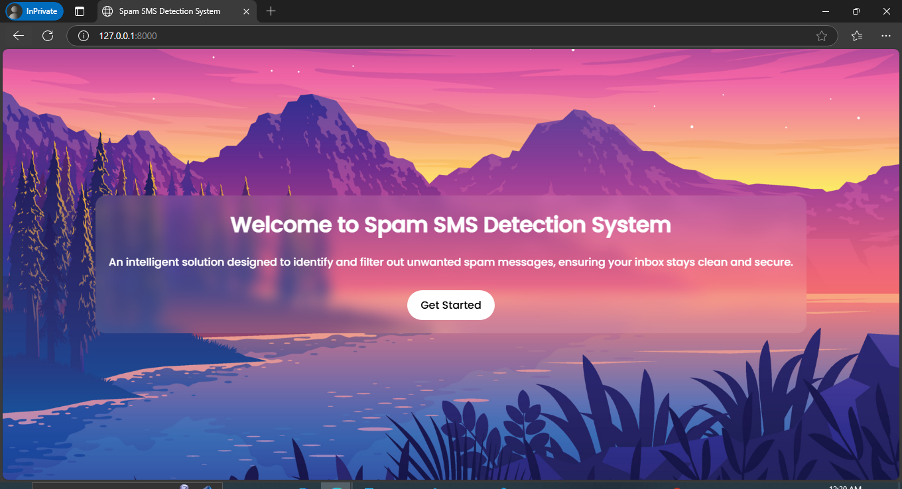
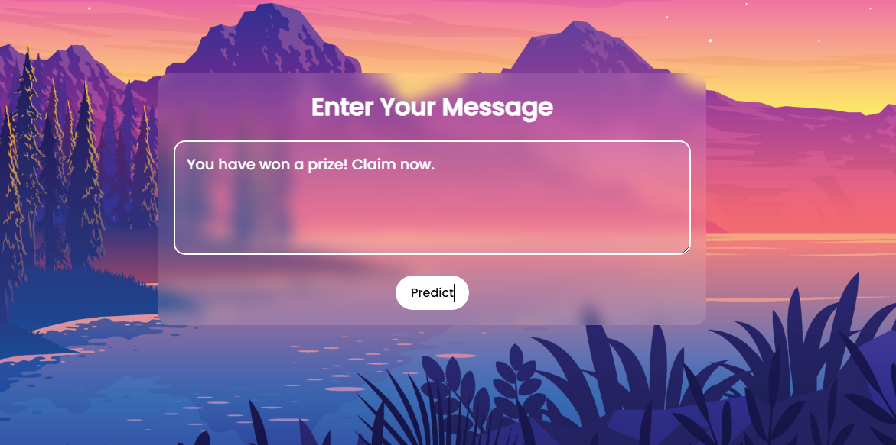
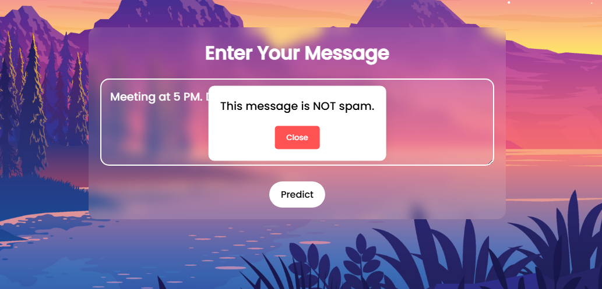

# Spam SMS Detection System

Welcome to the **Spam SMS Detection System** project! This web-based application detects spam messages using a simple and intuitive user interface. Built using **Django**, this project aims to demonstrate how AI models can be integrated into web applications to solve real-world problems.

---

## 🌟 Features
- **User-friendly UI** with animated dialogs
- Real-time **Spam Detection** based on keyword analysis
- Built with **Django Framework**
- Responsive design with an attractive layout

---

## 🚀 Installation Guide
Follow these steps to set up the project on your local machine.

### 1️⃣ **Clone the Repository**
```bash
git clone https://github.com/your-username/SpamSmsDetection.git
cd SpamSmsDetection
```

### 2️⃣ **Create a Virtual Environment**
```bash
python -m venv env
source env/bin/activate   # On Linux/Mac
env\Scripts\activate     # On Windows
```

### 3️⃣ **Install Dependencies**
```bash
pip install -r requirements.txt
```

### 4️⃣ **Run Migrations**
```bash
python manage.py migrate
```

### 5️⃣ **Start the Server**
```bash
python manage.py runserver
```

Open your browser and go to `http://localhost:8000` to see the app in action.

---

## 📂 Project Structure
```
SpamSmsDetection/
│
├── SpamSmsDetection/     # Django Project Folder
├── static/               # Static Files (CSS, JS, Images)
├── templates/            # HTML Templates
├── manage.py             # Django Management Script
└── requirements.txt      # Dependencies
```

---

## 📸 User Interface Preview

### **Landing Page**

### **Prediction Form**



---

## 🧪 How It Works
The **Spam SMS Detection System** works by analyzing the input message and identifying common spam keywords. It provides a real-time prediction to inform the user whether the message is spam or not.

### ⚙️ **Detection Logic** (Simplified)
- Messages containing words like "win", "prize", "offer" are flagged as spam.
- Non-spam messages are recognized as safe.

---

## 📄 Example Messages
| **Message**                          | **Prediction** |
|--------------------------------------|----------------|
| "You have won a prize! Claim now."  | Spam           |
| "Meeting at 5 PM. Don't be late."    | Not Spam       |

---

## 🤖 Future Enhancements
- Integrate **Machine Learning Model** for more accurate spam detection.
- Add **User Authentication** for personalized spam filters.
- Implement **Database Storage** for message history.

---

## 📧 Contact
Feel free to reach out if you have any questions or suggestions!

- **GitHub**: [Sandesh-Pol](https://github.com/Sandesh-Pol/SpamSmsDetection)
- **Email**: sandeshpol268@gmail.com

---

Made with ❤️ by Sandesh Pol
